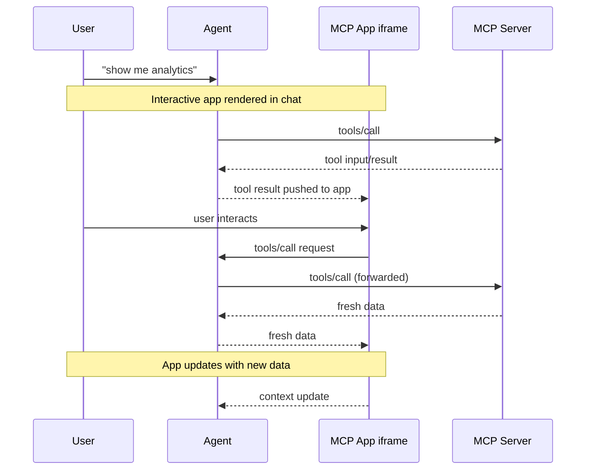

> ## Documentation Index
> Fetch the complete documentation index at: https://modelcontextprotocol.io/llms.txt
> Use this file to discover all available pages before exploring further.

# MCP Apps

> Build interactive UI applications that render inside MCP hosts like Claude Desktop

<Tip>
  For comprehensive API documentation, advanced patterns, and the full specification, visit the [official MCP Apps documentation](https://modelcontextprotocol.github.io/ext-apps).
</Tip>

Text responses can only go so far. Sometimes users need to interact with data, not
just read about it. MCP Apps let servers return interactive HTML interfaces (data
visualizations, forms, dashboards) that render directly in the chat.

## Why not just build a web app?

You could build a standalone web app and send users a link. However, MCP Apps
offer these key advantages that a separate page can't match:

**Context preservation.** The app lives inside the conversation. Users don't
switch tabs, lose their place, or wonder which chat thread had that dashboard.
The UI is right there, alongside the discussion that led to it.

**Bidirectional data flow.** Your app can call any tool on the MCP server, and
the host can push fresh results to your app. A standalone web app would need its
own API, authentication, and state management. MCP Apps get this via existing
MCP patterns.
**Integration with the host's capabilities**. The app can delegate actions to the host, which can then invoke the capabilities and tools the user has already connected (subject to user consent). Instead of every app implementing and maintaining direct integrations (e.g., email providers), the app can request an outcome (like “schedule this meeting”), and the host routes it through the user’s existing connected capabilities.
**Security guarantees.** MCP Apps run in a sandboxed iframe controlled by the
host. They can't access the parent page, steal cookies, or escape their
container. This means hosts can safely render third-party apps without trusting
the server author completely.

If your use case doesn't benefit from these properties, a regular web app might
be simpler. But if you want tight integration with the LLM-based conversation,
MCP Apps are a much better tool.

## How MCP Apps work

Traditional MCP tools return text, images, resources or structured data that the host displays as
part of the conversation. MCP Apps extend this pattern by allowing tools to
declare a reference to an interactive UI in their tool description that the host
renders in place.

The core pattern combines two MCP primitives: a tool that declares a UI resource
in its description, plus a UI resource that renders data as an interactive HTML
interface.

When a large language model (LLM) decides to call a tool that supports MCP Apps,
here's what happens:

1. **UI preloading**: The tool description includes a `_meta.ui.resourceUri`
   field pointing to a `ui://` resource. The host can preload this resource before
   the tool is even called, enabling features like streaming tool inputs to the
   app.

2. **Resource fetch**: The host fetches the UI resource from the server. This
   resource contains an HTML page, often bundled with its JavaScript and CSS for
   simplicity. Apps can also load external scripts and resources from origins
   specified in `_meta.ui.csp`.

3. **Sandboxed rendering**: Web hosts typically render the HTML inside a
   sandboxed [iframe](https://developer.mozilla.org/en-US/docs/Web/HTML/Element/iframe)
   within the conversation. The sandbox restricts the app's access to the parent
   page, ensuring security. The resource's `_meta.ui` object can include
   `permissions` to request additional capabilities (e.g., microphone, camera)
   and `csp` to control what external origins the app can load resources from.

4. **Bidirectional communication**: The app and host communicate through a
   JSON-RPC protocol that forms its own dialect of MCP. Some requests and
   notifications are shared with the core MCP protocol (e.g., `tools/call`), some
   are similar (e.g., `ui/initialize`), and most are new with a `ui/` method name
   prefix. The app can request tool calls, send messages, update the model's
   context, and receive data from the host.



The app stays isolated from the host but can still call MCP tools through the
secure postMessage channel.

## When to use MCP Apps

MCP Apps are a good fit when your use case involves:

**Exploring complex data.** A user asks "show me sales by region." A text
response might list numbers, but an MCP App can render an interactive map where
users click regions to drill down, hover for details, and toggle between
metrics, all without additional prompts.

**Configuring with many options.** Setting up a deployment involves dozens of
interdependent choices. Rather than a back-and-forth conversation ("Which
region?" "What instance size?" "Enable autoscaling?"), an MCP App presents a
form where users see all options at once, with validation and defaults.

**Viewing rich media.** When a user asks to review a PDF, see a 3D model, or
preview generated images, text descriptions fall short. An MCP App embeds the
actual viewer (pan, zoom, rotate) directly in the conversation.

**Real-time monitoring.** A dashboard showing live metrics, logs, or system
status needs continuous updates. An MCP App maintains a persistent connection,
updating the display as data changes without requiring the user to ask "what's
the status now?"

**Multi-step workflows.** Approving expense reports, reviewing code changes, or
triaging issues involves examining items one by one. An MCP App provides
navigation controls, action buttons, and state that persists across
interactions.

## Getting started

You'll need [Node.js](https://nodejs.org/en/download) 18 or higher. Familiarity
with [MCP tools](/specification/2025-11-25/server/tools) and
[resources](/specification/2025-11-25/server/resources) is recommended since MCP
Apps combine both primitives. Experience with the
[MCP TypeScript SDK](https://github.com/modelcontextprotocol/typescript-sdk)
will help you better understand the server-side patterns.

The fastest way to create an MCP App is using an AI coding agent with the MCP
Apps skill. If you prefer to set up a project manually, skip to
[Manual setup](#manual-setup).

### Using an AI coding agent

AI coding agents with Skills support can scaffold a complete MCP App project for
you. Skills are folders of instructions and resources that your agent loads when
relevant. They teach the AI how to perform specialized tasks like creating MCP
Apps.

The `create-mcp-app` skill includes architecture guidance, best practices, and
working examples that the agent uses to generate your project.

<Steps>
  <Step title="Install the skill">
    If you are using Claude Code, you can install the skill directly with:

    ```
    /plugin marketplace add modelcontextprotocol/ext-apps
    /plugin install mcp-apps@modelcontextprotocol-ext-apps
    ```

    You can also use the [Vercel Skills CLI](https://skills.sh/) to install skills across different AI coding agents:

    ```bash  theme={null}
    npx skills add modelcontextprotocol/ext-apps
    ```

    Alternatively, you can install the skill manually by cloning the ext-apps repository:

    ```bash  theme={null}
    git clone https://github.com/modelcontextprotocol/ext-apps.git
    ```

    And then copying the skill to the appropriate location for your agent:

    | Agent                                                                                                                                                                        | Skills directory (macOS/Linux) | Skills directory (Windows)            |
    | ---------------------------------------------------------------------------------------------------------------------------------------------------------------------------- | ------------------------------ | ------------------------------------- |
    | [Claude Code](https://docs.anthropic.com/en/docs/claude-code/skills)                                                                                                         | `~/.claude/skills/`            | `%USERPROFILE%\.claude\skills\`       |
    | [VS Code](https://code.visualstudio.com/docs/copilot/customization/agent-skills) and [GitHub Copilot](https://docs.github.com/en/copilot/concepts/agents/about-agent-skills) | `~/.copilot/skills/`           | `%USERPROFILE%\.copilot\skills\`      |
    | [Gemini CLI](https://geminicli.com/docs/cli/skills/)                                                                                                                         | `~/.gemini/skills/`            | `%USERPROFILE%\.gemini\skills\`       |
    | [Cline](https://cline.bot/blog/cline-3-48-0-skills-and-websearch-make-cline-smarter)                                                                                         | `~/.cline/skills/`             | `%USERPROFILE%\.cline\skills\`        |
    | [Goose](https://block.github.io/goose/docs/guides/context-engineering/using-skills/)                                                                                         | `~/.config/goose/skills/`      | `%USERPROFILE%\.config\goose\skills\` |
    | [Codex](https://developers.openai.com/codex/skills/)                                                                                                                         | `~/.codex/skills/`             | `%USERPROFILE%\.codex\skills\`        |

    <Note>
      This list is not comprehensive. Other agents may support skills in different locations; check your agent's documentation.
    </Note>

    For example, with Claude Code you can install the skill globally (available in all projects):

    <CodeGroup>
      ```bash macOS/Linux theme={null}
      cp -r ext-apps/plugins/mcp-apps/skills/create-mcp-app ~/.claude/skills/create-mcp-app
      ```

      ```powershell Windows theme={null}
      Copy-Item -Recurse ext-apps\plugins\mcp-apps\skills\create-mcp-app $env:USERPROFILE\.claude\skills\create-mcp-app
      ```
    </CodeGroup>

    Or install it for a single project only by copying to `.claude/skills/` in your project directory:

    <CodeGroup>
      ```bash macOS/Linux theme={null}
      mkdir -p .claude/skills && cp -r ext-apps/plugins/mcp-apps/skills/create-mcp-app .claude/skills/create-mcp-app
      ```

      ```powershell Windows theme={null}
      New-Item -ItemType Directory -Force -Path .claude\skills | Out-Null; Copy-Item -Recurse ext-apps\plugins\mcp-apps\skills\create-mcp-app .claude\skills\create-mcp-app
      ```
    </CodeGroup>

    To verify the skill is installed, ask your agent "What skills do you have access to?" — you should see `create-mcp-app` as one of the available skills.
  </Step>

  <Step title="Create your app">
    Ask your AI coding agent to build it:

    ```
    Create an MCP App that displays a color picker
    ```

    The agent will recognize the `create-mcp-app` skill is relevant, load its instructions, then scaffold a complete project with server, UI, and configuration files.

    <Frame caption="Creating a new MCP App with Claude Code">
      
    </Frame>
  </Step>

  <Step title="Run your app">
    <CodeGroup>
      ```bash macOS/Linux theme={null}
      npm install && npm run build && npm run serve
      ```

      ```powershell Windows theme={null}
      npm install; npm run build; npm run serve
      ```
    </CodeGroup>

    <Tip>
      You might need to make sure that you are first in the **app folder** before running the commands above.
    </Tip>
  </Step>

  <Step title="Test your app">
    Follow the instructions in [Testing your app](#testing-your-app) below. For the color picker example, start a new chat and ask Claude to provide you a color picker.

    <Frame caption="Testing the color picker in Claude">
      
    </Frame>
  </Step>
</Steps>

### Manual setup

If you're not using an AI coding agent, or prefer to understand the setup
process, follow these steps.

<Steps>
  <Step title="Create the project structure">
    A typical MCP App project separates the server code from the UI code:

    <Tree>
      <Tree.Folder name="my-mcp-app" defaultOpen>
        <Tree.File name="package.json" />

        <Tree.File name="tsconfig.json" />

        <Tree.File name="vite.config.ts" />

        <Tree.File name="server.ts" comment="MCP server with tool + resource" />

        <Tree.File name="mcp-app.html" comment="UI entry point" />

        <Tree.Folder name="src" defaultOpen>
          <Tree.File name="mcp-app.ts" comment="UI logic" />
        </Tree.Folder>
      </Tree.Folder>
    </Tree>

    The server registers the tool and serves the UI resource. The UI files get bundled into a single HTML file that the server returns when the host requests the resource.
  </Step>

  <Step title="Install dependencies">
    ```bash  theme={null}
    npm install @modelcontextprotocol/ext-apps @modelcontextprotocol/sdk
    npm install -D typescript vite vite-plugin-singlefile express cors @types/express @types/cors tsx
    ```

    The `ext-apps` package provides helpers for both the server side (registering tools and resources) and the client side (the `App` class for UI-to-host communication). Vite with the `vite-plugin-singlefile` plugin bundles your UI into a single HTML file that can be served as a resource.
  </Step>

  <Step title="Configure the project">
    <Tabs>
      <Tab title="package.json">
        The `"type": "module"` setting enables ES module syntax. The `build` script uses the `INPUT` environment variable to tell Vite which HTML file to bundle. The `serve` script runs your server using `tsx` for TypeScript execution.

        ```json  theme={null}
        {
          "type": "module",
          "scripts": {
            "build": "INPUT=mcp-app.html vite build",
            "serve": "npx tsx server.ts"
          }
        }
        ```
      </Tab>

      <Tab title="tsconfig.json">
        The TypeScript configuration targets modern JavaScript (`ES2022`) and uses ESNext modules with bundler resolution, which works well with Vite. The `include` array covers both the server code in the root and UI code in `src/`.

        ```json  theme={null}
        {
          "compilerOptions": {
            "target": "ES2022",
            "module": "ESNext",
            "moduleResolution": "bundler",
            "strict": true,
            "esModuleInterop": true,
            "skipLibCheck": true,
            "outDir": "dist"
          },
          "include": ["*.ts", "src/**/*.ts"]
        }
        ```
      </Tab>

      <Tab title="vite.config.ts">
        ```typescript  theme={null}
        import { defineConfig } from "vite";
        import { viteSingleFile } from "vite-plugin-singlefile";

        export default defineConfig({
          plugins: [viteSingleFile()],
          build: {
            outDir: "dist",
            rollupOptions: {
              input: process.env.INPUT,
            },
          },
        });
        ```
      </Tab>
    </Tabs>
  </Step>

  <Step title="Build the project">
    With the project structure and configuration in place, continue to [Building an MCP App](#building-an-mcp-app) below to implement the server and UI.
  </Step>
</Steps>

## Building an MCP App

Let's build a simple app that displays the current server time. This example
demonstrates the full pattern: registering a tool with UI metadata, serving the
bundled HTML as a resource, and building a UI that communicates with the server.

### Server implementation

The server needs to do two things: register a tool that includes the
`_meta.ui.resourceUri` field, and register a resource handler that serves the
bundled HTML. Here's the complete server file:

```typescript  theme={null}
// server.ts
console.log("Starting MCP App server...");

import { McpServer } from "@modelcontextprotocol/sdk/server/mcp.js";
import { StreamableHTTPServerTransport } from "@modelcontextprotocol/sdk/server/streamableHttp.js";
import {
  registerAppTool,
  registerAppResource,
  RESOURCE_MIME_TYPE,
} from "@modelcontextprotocol/ext-apps/server";
import cors from "cors";
import express from "express";
import fs from "node:fs/promises";
import path from "node:path";

const server = new McpServer({
  name: "My MCP App Server",
  version: "1.0.0",
});

// The ui:// scheme tells hosts this is an MCP App resource.
// The path structure is arbitrary; organize it however makes sense for your app.
const resourceUri = "ui://get-time/mcp-app.html";

// Register the tool that returns the current time
registerAppTool(
  server,
  "get-time",
  {
    title: "Get Time",
    description: "Returns the current server time.",
    inputSchema: {},
    _meta: { ui: { resourceUri } },
  },
  async () => {
    const time = new Date().toISOString();
    return {
      content: [{ type: "text", text: time }],
    };
  },
);

// Register the resource that serves the bundled HTML
registerAppResource(
  server,
  resourceUri,
  resourceUri,
  { mimeType: RESOURCE_MIME_TYPE },
  async () => {
    const html = await fs.readFile(
      path.join(import.meta.dirname, "dist", "mcp-app.html"),
      "utf-8",
    );
    return {
      contents: [
        { uri: resourceUri, mimeType: RESOURCE_MIME_TYPE, text: html },
      ],
    };
  },
);

// Expose the MCP server over HTTP
const expressApp = express();
expressApp.use(cors());
expressApp.use(express.json());

expressApp.post("/mcp", async (req, res) => {
  const transport = new StreamableHTTPServerTransport({
    sessionIdGenerator: undefined,
    enableJsonResponse: true,
  });
  res.on("close", () => transport.close());
  await server.connect(transport);
  await transport.handleRequest(req, res, req.body);
});

expressApp.listen(3001, (err) => {
  if (err) {
    console.error("Error starting server:", err);
    process.exit(1);
  }
  console.log("Server listening on http://localhost:3001/mcp");
});
```

Let's break down the key parts:

* **`resourceUri`**: The `ui://` scheme tells hosts this is an MCP App resource.
  The path structure is arbitrary.
* **`registerAppTool`**: Registers a tool with the `_meta.ui.resourceUri` field.
  When the host calls this tool, the UI is fetched and rendered, and the tool result is passed to it upon arrival.
* **`registerAppResource`**: Serves the bundled HTML when the host requests the UI resource.
* **Express server**: Exposes the MCP server over HTTP on port 3001.

### UI implementation

The UI consists of an HTML page and a TypeScript module that uses the `App`
class to communicate with the host. Here's the HTML:

```html  theme={null}
<!-- mcp-app.html -->
<!DOCTYPE html>
<html lang="en">
  <head>
    <meta charset="UTF-8" />
    <title>Get Time App</title>
  </head>
  <body>
    <p>
      <strong>Server Time:</strong>
      <code id="server-time">Loading...</code>
    </p>
    <button id="get-time-btn">Get Server Time</button>
    <script type="module" src="/src/mcp-app.ts"></script>
  </body>
</html>
```

And the TypeScript module:

```typescript  theme={null}
// src/mcp-app.ts
import { App } from "@modelcontextprotocol/ext-apps";

const serverTimeEl = document.getElementById("server-time")!;
const getTimeBtn = document.getElementById("get-time-btn")!;

const app = new App({ name: "Get Time App", version: "1.0.0" });

// Establish communication with the host
app.connect();

// Handle the initial tool result pushed by the host
app.ontoolresult = (result) => {
  const time = result.content?.find((c) => c.type === "text")?.text;
  serverTimeEl.textContent = time ?? "[ERROR]";
};

// Proactively call tools when users interact with the UI
getTimeBtn.addEventListener("click", async () => {
  const result = await app.callServerTool({
    name: "get-time",
    arguments: {},
  });
  const time = result.content?.find((c) => c.type === "text")?.text;
  serverTimeEl.textContent = time ?? "[ERROR]";
});
```

The key parts:

* **`app.connect()`**: Establishes communication with the host. Call this once
  when your app initializes.
* **`app.ontoolresult`**: A callback that fires when the host pushes a tool
  result to your app (e.g., when the tool is first called and the UI renders).
* **`app.callServerTool()`**: Lets your app proactively call tools on the server.
  Keep in mind that each call involves a round-trip to the server, so design your
  UI to handle latency gracefully.

The `App` class provides additional methods for logging, opening URLs, and
updating the model's context with structured data from your app. See the full
[API documentation](https://modelcontextprotocol.github.io/ext-apps/api/).

## Testing your app

To test your MCP App, build the UI and start your local server:

<CodeGroup>
  ```bash macOS/Linux theme={null}
  npm run build && npm run serve
  ```

  ```powershell Windows theme={null}
  npm run build; npm run serve
  ```
</CodeGroup>

In the default configuration, your server will be available at
`http://localhost:3001/mcp`. However, to see your app render, you need an MCP
host that supports MCP Apps. You have several options.

### Testing with Claude

[Claude](https://claude.ai) (web) and [Claude Desktop](https://claude.ai/download)
support MCP Apps. For local development, you'll need to expose your server to
the internet. You can run an MCP server locally and use tools like `cloudflared`
to tunnel traffic through.

In a separate terminal, run:

```bash  theme={null}
npx cloudflared tunnel --url http://localhost:3001
```

Copy the generated URL (e.g., `https://random-name.trycloudflare.com`) and add it
as a [custom connector](https://support.anthropic.com/en/articles/11175166-getting-started-with-custom-connectors-using-remote-mcp)
in Claude - click on your profile, go to **Settings**, **Connectors**, and
finally **Add custom connector**.

<Note>
  Custom connectors are available on paid Claude plans (Pro, Max, or Team).
</Note>

<Frame caption="Adding a custom connector in Claude">
  
</Frame>

### Testing with the basic-host

The `ext-apps` repository includes a test host for development. Clone the repo and
install dependencies:

<CodeGroup>
  ```bash macOS/Linux theme={null}
  git clone https://github.com/modelcontextprotocol/ext-apps.git
  cd ext-apps/examples/basic-host
  npm install
  ```

  ```powershell Windows theme={null}
  git clone https://github.com/modelcontextprotocol/ext-apps.git
  cd ext-apps\examples\basic-host
  npm install
  ```
</CodeGroup>

Running `npm start` from `ext-apps/examples/basic-host/` will start the basic-host
test interface. To connect it to a specific server (e.g., one you're developing),
pass the `SERVERS` environment variable inline:

<CodeGroup>
  ```bash macOS/Linux theme={null}
  SERVERS='["http://localhost:3001"]' npm start
  ```

  ```powershell Windows theme={null}
  $env:SERVERS='["http://localhost:3001"]'; npm start
  ```
</CodeGroup>

Navigate to `http://localhost:8080`. You'll see a simple interface where you can
select a tool and call it. When you call your tool, the host fetches the UI
resource and renders it in a sandboxed iframe. You can then interact with your
app and verify that tool calls work correctly.

<Frame caption="Testing the QR code MCP App with the basic host">
  
</Frame>

## Security model

MCP Apps run in a sandboxed
[iframe](https://developer.mozilla.org/docs/Web/HTML/Element/iframe), which
provides strong isolation from the host application. The sandbox prevents your
app from accessing the parent window's
[DOM](https://developer.mozilla.org/docs/Web/API/Document_Object_Model), reading
the host's cookies or local storage, navigating the parent page, or executing
scripts in the parent context.

All communication between your app and the host goes through the
[postMessage API](https://developer.mozilla.org/docs/Web/API/Window/postMessage),
which the `App` class shown above abstracts for you. The host controls which
capabilities your app can access. For example, a host might restrict which tools
an app can call or disable the `sendOpenLink` capability.

The sandbox is designed to prevent apps from escaping to access the host or user data.

## Framework support

MCP Apps use their own dialect of MCP, built on JSON-RPC like the core protocol.
Some messages are shared with regular MCP (e.g., `tools/call`), while others are
specific to apps (e.g., `ui/initialize`). The transport is
[postMessage](https://developer.mozilla.org/docs/Web/API/Window/postMessage)
instead of stdio or HTTP. Since it's all standard web primitives, you can use any
framework or none at all.

The `App` class from `@modelcontextprotocol/ext-apps` is a convenience wrapper,
not a requirement. You can implement the
[postMessage protocol](https://github.com/modelcontextprotocol/ext-apps/blob/main/specification/draft/apps.mdx)
directly if you prefer to avoid dependencies or need tighter control.

The [examples directory](https://github.com/modelcontextprotocol/ext-apps/tree/main/examples)
includes starter templates for React, Vue, Svelte, Preact, Solid, and vanilla
JavaScript. These demonstrate recommended patterns for each framework's system,
but they're examples rather than requirements. You can choose whatever works
best for your use case.

## Client support

<Note>
  MCP Apps is an extension to the [core MCP specification](/specification). Host support varies by client.
</Note>

MCP Apps are currently supported by [Claude](https://claude.ai),
[Claude Desktop](https://claude.ai/download),
[Visual Studio Code (Insiders)](https://code.visualstudio.com/insiders), [Goose](https://block.github.io/goose/), [Postman](https://postman.com), and [MCPJam](https://www.mcpjam.com/). See the
[clients page](/clients) for the full list of MCP clients and their supported
features.

If you're building an MCP client and want to support MCP Apps, you have two options:

1. **Use a framework**: The [`@mcp-ui/client`](https://github.com/MCP-UI-Org/mcp-ui)
   package provides React components for rendering and interacting with MCP Apps
   views in your host application. See the
   [MCP-UI documentation](https://mcpui.dev/) for usage details.

2. **Build on AppBridge**: The SDK includes an
   [**App Bridge**](https://modelcontextprotocol.github.io/ext-apps/api/modules/app-bridge.html)
   module that handles rendering apps in sandboxed iframes, message passing, tool
   call proxying, and security policy enforcement. The
   [basic-host example](https://github.com/modelcontextprotocol/ext-apps/tree/main/examples/basic-host)
   shows how to integrate it.

See the [API documentation](https://modelcontextprotocol.github.io/ext-apps/api/)
for implementation details.

## Examples

The [ext-apps repository](https://github.com/modelcontextprotocol/ext-apps/tree/main/examples)
includes ready-to-run examples demonstrating different use cases:

* **3D and visualization**:
  [map-server](https://github.com/modelcontextprotocol/ext-apps/tree/main/examples/map-server)
  (CesiumJS globe),
  [threejs-server](https://github.com/modelcontextprotocol/ext-apps/tree/main/examples/threejs-server)
  (Three.js scenes),
  [shadertoy-server](https://github.com/modelcontextprotocol/ext-apps/tree/main/examples/shadertoy-server)
  (shader effects)
* **Data exploration**:
  [cohort-heatmap-server](https://github.com/modelcontextprotocol/ext-apps/tree/main/examples/cohort-heatmap-server),
  [customer-segmentation-server](https://github.com/modelcontextprotocol/ext-apps/tree/main/examples/customer-segmentation-server),
  [wiki-explorer-server](https://github.com/modelcontextprotocol/ext-apps/tree/main/examples/wiki-explorer-server)
* **Business applications**:
  [scenario-modeler-server](https://github.com/modelcontextprotocol/ext-apps/tree/main/examples/scenario-modeler-server),
  [budget-allocator-server](https://github.com/modelcontextprotocol/ext-apps/tree/main/examples/budget-allocator-server)
* **Media**:
  [pdf-server](https://github.com/modelcontextprotocol/ext-apps/tree/main/examples/pdf-server),
  [video-resource-server](https://github.com/modelcontextprotocol/ext-apps/tree/main/examples/video-resource-server),
  [sheet-music-server](https://github.com/modelcontextprotocol/ext-apps/tree/main/examples/sheet-music-server),
  [say-server](https://github.com/modelcontextprotocol/ext-apps/tree/main/examples/say-server)
  (text-to-speech)
* **Utilities**:
  [qr-server](https://github.com/modelcontextprotocol/ext-apps/tree/main/examples/qr-server),
  [system-monitor-server](https://github.com/modelcontextprotocol/ext-apps/tree/main/examples/system-monitor-server),
  [transcript-server](https://github.com/modelcontextprotocol/ext-apps/tree/main/examples/transcript-server)
  (speech-to-text)
* **Starter templates**:
  [React](https://github.com/modelcontextprotocol/ext-apps/tree/main/examples/basic-server-react),
  [Vue](https://github.com/modelcontextprotocol/ext-apps/tree/main/examples/basic-server-vue),
  [Svelte](https://github.com/modelcontextprotocol/ext-apps/tree/main/examples/basic-server-svelte),
  [Preact](https://github.com/modelcontextprotocol/ext-apps/tree/main/examples/basic-server-preact),
  [Solid](https://github.com/modelcontextprotocol/ext-apps/tree/main/examples/basic-server-solid),
  [vanilla JavaScript](https://github.com/modelcontextprotocol/ext-apps/tree/main/examples/basic-server-vanillajs)

To run any example:

<CodeGroup>
  ```bash macOS/Linux theme={null}
  git clone https://github.com/modelcontextprotocol/ext-apps
  cd ext-apps/examples/<example-name>
  npm install && npm start
  ```

  ```powershell Windows theme={null}
  git clone https://github.com/modelcontextprotocol/ext-apps
  cd ext-apps\examples\<example-name>
  npm install; npm start
  ```
</CodeGroup>

## Learn more

<CardGroup cols={2}>
  <Card title="API Documentation" icon="book" href="https://modelcontextprotocol.github.io/ext-apps/api/">
    Full SDK reference and API details
  </Card>

  <Card title="GitHub Repository" icon="github" href="https://github.com/modelcontextprotocol/ext-apps">
    Source code, examples, and issue tracker
  </Card>

  <Card title="Specification" icon="file-lines" href="https://github.com/modelcontextprotocol/ext-apps/blob/main/specification/draft/apps.mdx">
    Technical specification for implementers
  </Card>
</CardGroup>

## Feedback

MCP Apps is under active development. If you encounter issues or have ideas for
improvements, open an issue on the
[GitHub repository](https://github.com/modelcontextprotocol/ext-apps/issues).
For broader discussions about the extension's direction, join the conversation
in [GitHub Discussions](https://github.com/modelcontextprotocol/ext-apps/discussions).
